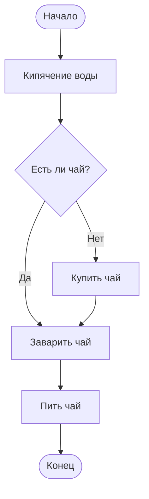
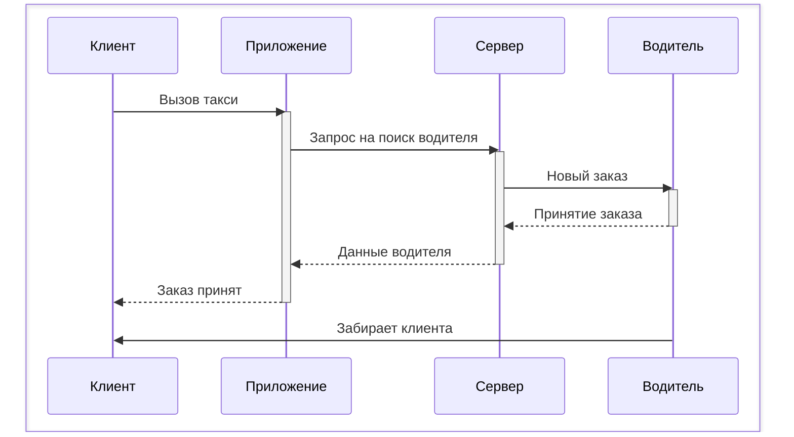
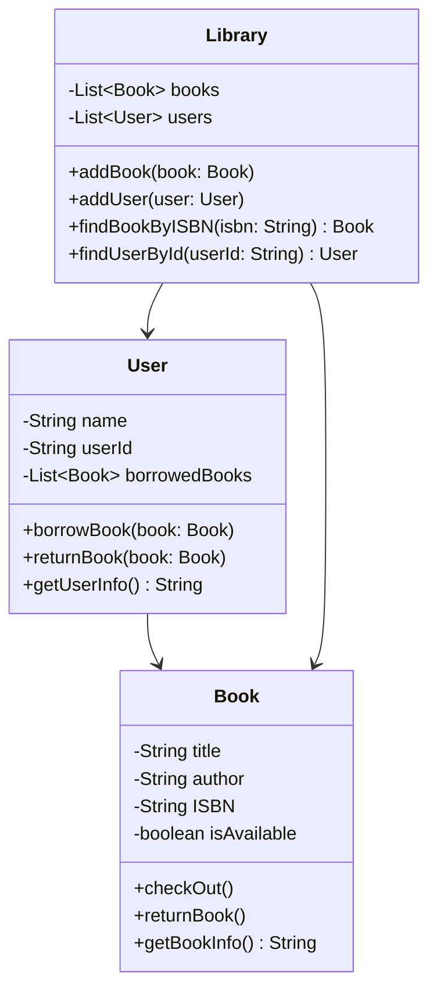
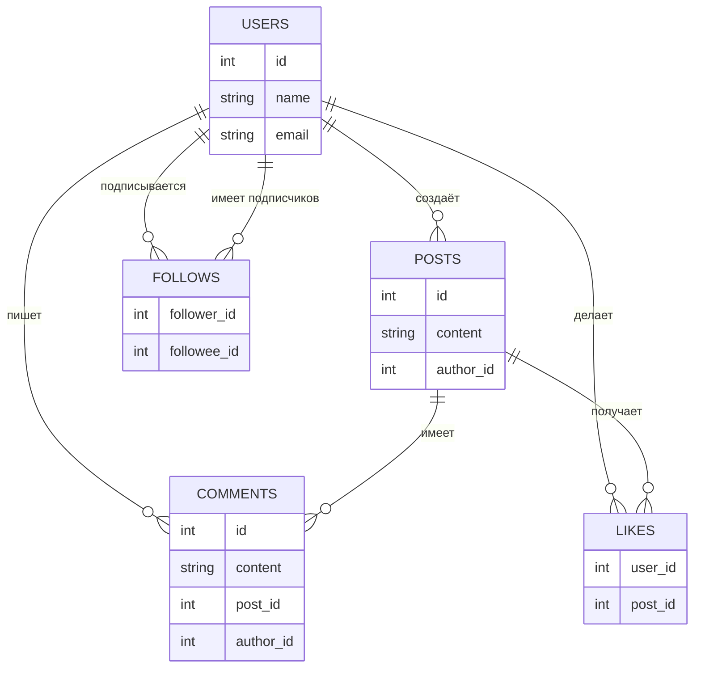
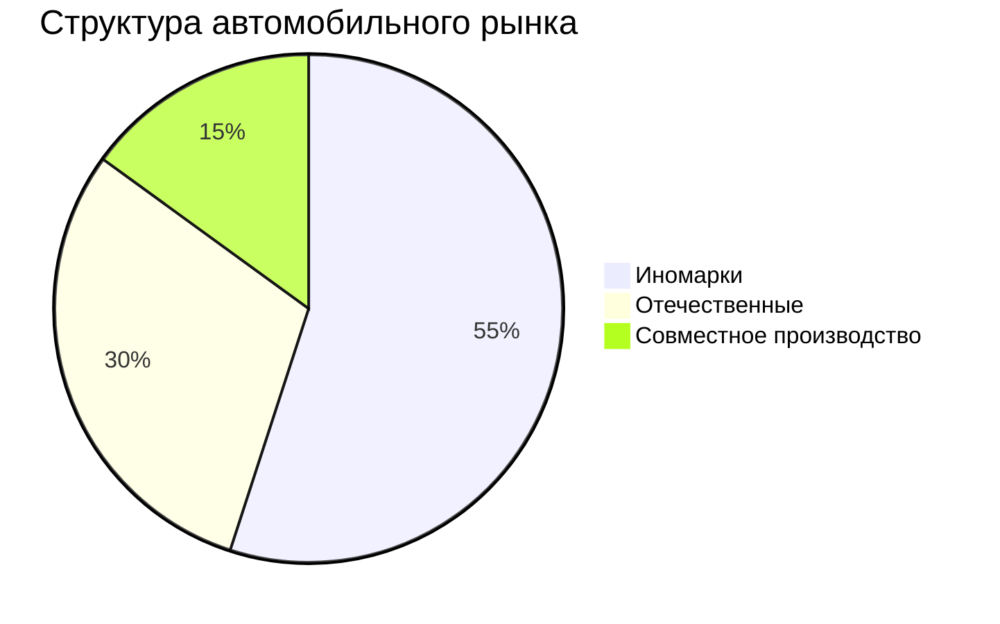

Выполнил: Козлов Артем
группа: Ипо8482

1.1




1.2




2.1



2.2 

 ```mermaid 

gantt
    title Проект: Разработка мобильного приложения
    dateFormat  YYYY-MM-DD
    axisFormat  %d.%m

    section Подготовка
    Подготовка проекта          :prep, 2025-01-01, 5d

    section Дизайн
    Разработка дизайна          :design, after prep, 7d

    section Разработка
    Фронтенд‑разработка         :frontend, after design, 10d
    Бэкенд‑разработка           :backend, after prep, 12d

    section Тестирование
    Тестирование приложения     :tests, after frontend, 5d
    Тестирование бэкенда        :tests_backend, after backend, 5d
    Интеграционное тестирование :integration, after tests, 3d
```
 
3.1

 ```mermaid
graph TB
    subgraph "Frontend"
        A1[React]
        A2[Redux]
        A3[Router]
    end
    
    subgraph "Backend"
        B1[Node.js]
        B2[Express]
        B3[MongoDB]
    end
    
    subgraph "Внешние сервисы"
        C1[Stripe]
        C2[SendGrid]
    end
    
    A1 -- "HTTP запросы" --> B2
    B2 -- "Работа с данными" --> B3
    B2 -- "Обработка платежей" --> C1
    B2 -- "Отправка email" --> C2
    A2 -- "Управление состоянием" --> A1
    A3 -- "Навигация" --> A1
    B1 -- "Запуск сервера" --> B2

 ```

 3.2

  ```mermaid 
stateDiagram-v2
    [*] --> Новый
    Новый --> Подтвержденный: подтвердить
    Подтвержденный --> Оплаченный: оплатить
    Подтвержденный --> Отмененный: отменить
    
    state Оплата {
        [*] --> Ожидание
        Ожидание --> Успешно: платеж прошел
        Ожидание --> Ошибка: платеж не прошел
        Ошибка --> Ожидание: повторить
    }
    
    Оплаченный --> Оплата: начать оплату
    Оплата --> Оплаченный: завершить оплату
    
    Оплаченный --> Отправленный: отправить
    Отправленный --> Доставленный: доставить
    Доставленный --> [*]: завершен
    Доставленный --> Возвращенный: вернуть товар
    Отмененный --> [*]
    Возвращенный --> [*]

 ```

 4.1


    
    5

 ```mermaid
    graph TD
    Start([Начало]) --> A[Выбор ресторана]
    A --> B[Выбор блюд]
    B --> C{Корзина пуста?}
    C -->|Да| B
    C -->|Нет| D[Оформление заказа]
    D --> E[Выбор доставки]
    E --> F[Ввод адреса]
    F --> G[Оплата]
    G --> H{Оплата успешна?}
    H -->|Нет| G
    H -->|Да| I[Подтверждение заказа]
    I --> J[Приготовление]
    J --> K[Доставка]
    K --> L[Получение заказа]
    L --> M[Оценка сервиса]
    M --> Finish([Конец])

 ```
6
